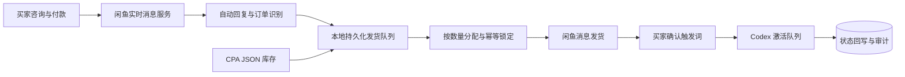

# Xianyu Codex Commerce Suite

闲鱼消息、订单与本地库存履约的一体化系统。

项目把买家咨询、付款识别、库存分配、自动发货、买家确认、Codex 激活和审计记录连接为一条可追踪的履约流程。

最后更新：2026-08-16。

## 更新记录

- 2026-06-26：已经结束的 Codex 邀请重置活动，也记念我当时在闲鱼完成的 300 多单重置。
- 2026-08-03：新出邀请好友送额度活动。与上一轮可以使用 Codex CLI 激活不同，本轮必须通过 ChatGPT 桌面端中的 Codex 发起会话，因此重新设计了桌面激活链路。
- 2026-08-04：最近进货侧以及openai风控提升，频繁掉凭证。但仍不影响反代链路，只是无法登录desktop，对于提供账号密码的凭证支持重拉Oauth刷新凭证。
- 2026-08-05：在闲鱼卖了 50 多单。高峰期出现发货延迟、桌面激活串行等问题，因此增加持久化发货队列、多实例激活和批量凭证更新。给闲鱼这群人售后太消耗精力，遂开源。
- 2026-08-14：在好心群友的技术支持下新增了协议激活方式——不再唤起桌面端发消息，而是装包成 WebSocket 帧直接走 Codex 协议发送激活，大大提升并发、减少占用；原有 CLI 与桌面端模式保留，后台可选择三种激活提供方。新方式为实验性功能，暂未经过真实账号测试。
- 2026-08-16：通过真实账号测试并修整 WebSocket 激活链路，现已确认真实可用并设为默认激活模式；保留全部可编辑配置，部署后填写可用代理即可激活。

## 项目简介

Xianyu Codex Commerce Suite 面向虚拟商品库存和自动履约场景，由闲鱼管理端、实时消息服务和本地库存中心组成。

闲鱼侧负责账号、聊天、商品、订单和卡券；履约中心负责 CPA JSON 库存、状态机、持久化队列、按数量出库、激活任务和审计。两个子系统通过本地 HTTP 接口连接，订单事件进入队列后立即返回，库存分配与消息发送由后台 worker 完成。

## 主要功能

- 闲鱼账号、聊天、商品、订单和卡券管理
- 受约束的 AI 客服回复与固定触发词识别
- CPA JSON 单条、批量文件和批量文本导入
- 按订单购买数量原子分配库存
- 未出库、已出库、待激活、已激活和失败状态管理
- 持久化发货队列、失败重试与数量补齐
- 买家确认消息回传和自动激活
- OAuth 单条刷新、激活前刷新和批量刷新
- 幂等键、审计日志和低库存提醒

## 系统架构



### 子系统

| 子系统 | 作用 |
| --- | --- |
| `services/xianyu-auto-reply/frontend` | React 管理端 |
| `services/xianyu-auto-reply/backend-web` | 账号、商品、订单和卡券 API |
| `services/xianyu-auto-reply/websocket` | 闲鱼实时消息、付款事件和履约回传 |
| `services/xianyu-auto-reply/scheduler` | 定时补发、状态同步和后台任务 |
| `services/xianyu-auto-reply/common` | 数据模型、数据库和公共服务 |
| `services/fulfillment-center` | 库存、发货队列、激活队列、OAuth 和审计 |

## 激活模式

履约中心保留三种激活提供方，可在“绑定与模板”中切换。

| 模式 | 说明 |
| --- | --- |
| `ws` | 默认模式。通过 Codex WebSocket 会话发送激活消息，不拉起桌面窗口 |
| `desktop` | 使用绑定的 ChatGPT/Codex 桌面实例，适合作为可视化回退 |
| `cli` | 使用 Codex CLI，保留给兼容场景 |

WebSocket 模式默认使用 `gpt-5.6-luna`、`originator=Codex Desktop` 和两阶段预热/turn 会话。代理、模型、客户端版本、重连次数和超时时间都可以在库存中心修改。

## 技术栈

| 领域 | 技术 |
| --- | --- |
| 闲鱼管理端 | React 18、TypeScript、Vite、Zustand |
| 闲鱼服务 | Python、FastAPI、SQLAlchemy、Playwright |
| 履约中心 | Python、FastAPI、HTTPX、WebSocket |
| 数据 | MySQL、Redis、SQLite |
| 本地运行 | Docker Compose、PowerShell、Windows Batch |

## 快速开始

### 环境要求

- Windows 10 或 Windows 11
- Python 3.11 及以上版本
- Node.js 18 及以上版本
- Docker Desktop
- Git

### 启动

```bat
git clone https://github.com/ZorIgn/xianyu-codex-commerce-suite.git
cd xianyu-codex-commerce-suite
start-all.bat
```

第一次运行时，脚本会在仓库目录内创建 Python 虚拟环境、npm 依赖、Playwright Chromium 和缓存目录，然后启动 MySQL、Redis 与五个应用服务。再次运行时会复用已安装依赖和已经健康的服务。

| 页面或服务 | 地址 |
| --- | --- |
| 闲鱼管理后台 | <http://127.0.0.1:9000> |
| 本地库存中心 | <http://127.0.0.1:8765> |
| 后端接口文档 | <http://127.0.0.1:8089/docs> |
| 闲鱼消息服务 | <http://127.0.0.1:8090/health> |
| 定时任务服务 | <http://127.0.0.1:8091/health> |

运行日志保存在根目录 `run-logs`。应用进程记录保存在 `run-state`，两者都不会进入 Git。

### 停止

```bat
stop-all.bat
```

该命令停止应用服务但保留 MySQL 和 Redis。需要一并停止基础设施时运行：

```bat
stop-infra.bat
```

## 基础配置

首次启动会从各服务的 `.env.example` 创建本地 `.env`。正式使用前需要检查以下两处。

### 闲鱼商品范围

文件：`services/xianyu-auto-reply/websocket/.env`

```env
FULFILLMENT_CENTER_ENABLED=true
FULFILLMENT_CENTER_URL=http://127.0.0.1:8765
FULFILLMENT_CENTER_ITEM_IDS=你的商品ID
FULFILLMENT_CENTER_ALL_ITEMS=false
```

优先填写明确的商品 ID。只有确认账号下所有商品都应连接本地库存时，才使用 `FULFILLMENT_CENTER_ALL_ITEMS=true`。

### 履约中心

文件：`services/fulfillment-center/.env`

```env
DRY_RUN=false
ACTIVATION_PROVIDER=ws
WS_PROXY_URL=http://127.0.0.1:7890
WS_MODEL=gpt-5.6-luna
WS_ORIGINATOR=Codex Desktop
```

也可以在库存中心的“绑定与模板”页面修改这些设置。WebSocket 代理地址需要与本机实际代理监听地址一致。

## 项目结构

```text
xianyu-codex-commerce-suite/
├── start-all.bat
├── stop-all.bat
├── stop-infra.bat
├── scripts/
│   ├── start-suite.ps1
│   ├── stop-suite.ps1
│   └── stop-infra.ps1
└── services/
    ├── xianyu-auto-reply/
    │   ├── frontend/
    │   ├── backend-web/
    │   ├── websocket/
    │   ├── scheduler/
    │   ├── common/
    │   └── docker-compose*.yml
    └── fulfillment-center/
        ├── app/
        └── tests/
```

## 安全说明

仓库不会跟踪 `.env`、库存数据库、账号 JSON、Cookie、Token、日志、虚拟环境、浏览器数据和运行缓存。公开部署时仍应配置访问控制、HTTPS、速率限制、敏感字段加密和日志保留周期。

## 项目来源

- 闲鱼系统基于 [`zhinianboke/xianyu-auto-reply`](https://github.com/zhinianboke/xianyu-auto-reply) 整理和二次开发。
- 本地库存履约中心由本项目新增。
- 账号供给侧工具见 [`ZorIgn/codex-oauth-auto-register`](https://github.com/ZorIgn/codex-oauth-auto-register)。

## 免责声明

本项目用于学习、研究和本地自动化流程复盘。使用者应遵守闲鱼、Codex 及相关第三方服务的条款和当地法律法规，不得用于虚假交易、垃圾消息、账号滥用或未经授权的访问。
