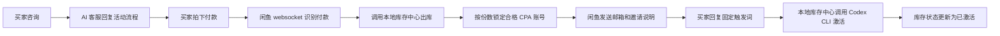

# 闲鱼 Codex 自动回复与库存履约中心

> 纪念已经逝去的 Codex 邀请重置活动，也纪念我在闲鱼跑过的 400 多单。这个项目把当时手工处理、库存出库、买家沟通和激活复核里最容易出错的部分整理成一套可以复盘、可以继续二次开发的工程。
>
> 起初我想直接用自己的注册机来持续供货，但真实订单量上来之后，注册产量太低，无法稳定支撑发货速度；所以这里采用「CPA JSON 批量导入 + 本地库存中心管理 + 闲鱼自动发货」作为主链路，注册机作为配套供给与后续扩展项目保留。

> 面向闲鱼虚拟商品交付场景的一体化项目：前端使用闲鱼自动回复/自动发货系统，后端使用本地库存履约中心管理 CPA 账号库存、订单出库、买家触发激活与审计幂等。

## 项目定位

本项目把两个核心系统整合为一个可部署仓库：

- **闲鱼自动回复前端/服务端**：负责闲鱼账号接入、咨询自动回复、订单识别、自动发货、商品与卡券绑定。
- **本地库存履约中心**：负责 CPA JSON 批量导入、库存筛选、订单出库、Codex CLI 激活、审计日志和幂等保护。

适用流程：买家咨询 → 买家付款 → 系统按订单份数自动出库 → 闲鱼发送邮箱/说明 → 买家回复固定触发词 → 后端自动激活。


## 项目来源与二次开发

本仓库是一个组合交付项目，核心来自以下项目和本地二次开发：

- 闲鱼自动回复与管理后台基于 [`zhinianboke/xianyu-auto-reply`](https://github.com/zhinianboke/xianyu-auto-reply) 整理改造，负责闲鱼账号接入、聊天、订单识别、商品、卡券和自动发货。
- 本地库存履约中心为本仓库新增服务，负责 CPA JSON 导入、库存状态机、幂等出库、激活回传和审计日志。
- 配套注册机项目：[`ZorIgn/codex-oauth-auto-register`](https://github.com/ZorIgn/codex-oauth-auto-register)，由 `aBaiAutoplus` 改造而来，加入 Codex OAuth 验证、CPA 导出、接码自动轮询和账号有效性复核相关能力。
- 注册机原改造项目参考 [`asz798838958/aBaiAutoplus`](https://github.com/asz798838958/aBaiAutoplus)，上游注册框架参考 [`lxf746/any-auto-register`](https://github.com/lxf746/any-auto-register)。

这里保留原项目的闲鱼前端能力，同时把卡券内容中的 `{DELIVERY_CONTENT}` 接到本地库存中心：买家付款后按份数扣减库存，发送邮箱与邀请说明；买家回复固定触发词后，再由本地库存中心执行 Codex CLI 激活与状态回写。

## 核心能力

- 闲鱼账号登录、在线聊天、商品管理、卡券管理、订单管理。
- Codex 邀请活动专用 AI 客服提示词，禁止砍价和无关幻觉。
- 商品付款后自动发货，优先调用本地库存中心扣库存。
- 支持多份订单，按真实订单数量一次性出库对应数量账号。
- CPA JSON 批量导入，自动筛选合格账号。
- 库存状态流转：未出库、已出库、已激活、激活失败。
- 买家固定触发词 `全部邮箱无误 已邀请` 自动回传并激活订单。
- 审计日志、幂等 Key、防重复出库、防重复发货。
- 低库存预警，库存不足 5 个时页面提示。

## 目录结构

```text
.
├─ services/
│  ├─ xianyu-auto-reply/        # 闲鱼自动回复/自动发货项目
│  │  ├─ frontend/              # 管理后台前端
│  │  ├─ backend-web/           # 管理后台 API
│  │  ├─ websocket/             # 闲鱼 IM、订单、发货主服务
│  │  ├─ scheduler/             # 定时任务服务
│  │  ├─ common/                # 公共模型、数据库、工具函数
│  │  └─ docker-compose*.yml    # MySQL/Redis 等基础设施
│  └─ fulfillment-center/       # 本地库存履约中心
│     ├─ app/                   # FastAPI 后端、库存、履约、Codex Runner
│     ├─ tests/                 # 履约中心测试
│     └─ requirements.txt
├─ scripts/
│  ├─ start-all.bat             # Windows 一键启动
│  ├─ stop-all.bat              # 停止应用端口
│  └─ stop-infra.bat            # 停止 Docker 基础设施
├─ .env.example                 # 根级配置示例
├─ .gitignore
└─ README.md
```

## 业务流程



## 环境要求

- Windows 10/11
- Python 3.11+
- Node.js 18+
- Docker Desktop
- Git
- 可用的 Codex CLI

> 建议所有工具和虚拟环境放在非系统盘，例如 `E:\account`，避免污染 C 盘。

## 快速启动

### 1. 配置环境变量

复制示例文件：

```bat
copy .env.example .env
```

再按自己的环境修改 `.env`。敏感信息不要提交到 Git。

### 2. 安装依赖

首次运行闲鱼项目依赖：

```bat
services\xianyu-auto-reply\install-all.bat
```

履约中心依赖：

```bat
cd services\fulfillment-center
python -m venv .venv
.venv\Scripts\pip install -r requirements.txt
```

### 3. 启动 Docker Desktop

管理员权限打开 Docker Desktop，等待 Engine running。

### 4. 一键启动

在仓库根目录运行：

```bat
scripts\start-all.bat
```

启动后访问：

- 闲鱼管理后台：http://127.0.0.1:9000
- 本地库存中心：http://127.0.0.1:8765
- 闲鱼 backend-web：http://127.0.0.1:8089
- 闲鱼 websocket：http://127.0.0.1:8090
- 闲鱼 scheduler：http://127.0.0.1:8091

## 前端操作说明

### 1. 绑定闲鱼账号

打开 `http://127.0.0.1:9000`，进入：

```text
账号管理 → 新增/编辑闲鱼账号 → 按项目页面提示登录
```

确保 websocket 服务窗口保持运行，否则无法接收闲鱼消息和订单事件。

### 2. 开启自动发货

进入：

```text
账号管理 → 当前闲鱼账号 → 设置
```

开启以下能力：

- 自动确认发货
- 自动发货
- 自动补发货（如果页面存在）

### 3. 商品绑定卡券

进入：

```text
商品管理 → 找到商品 → 关联卡券 → 选择“邮箱”卡券 → 保存
```

本项目通过“商品 → 卡券”关系判断该商品是否走本地库存中心。商品必须唯一绑定一张用于交付的卡券。

### 4. 设置卡券

进入：

```text
卡券管理 → 邮箱 → 编辑
```

建议：

- 卡券类型：固定文字
- 延时发货时间：0 或 1 秒
- 备注信息可写：`以下是您的邮箱 {DELIVERY_CONTENT}`

真实账号内容由本地库存中心返回，卡券主要承担“商品绑定发货链路”的作用。

## AI 客服提示词

前端 AI 回复设置里的“自定义提示词 JSON”建议使用：

```json
{
  "classify": "你是闲鱼店铺客服，只负责识别买家意图。商品是 Codex 邀请次数服务。买家咨询价格、砍价、优惠，归类为 price；买家问怎么用、入口在哪、邀请流程、次数、有效期，归类为 tech；其他商品相关咨询归类为 default。只返回分类名，不要解释。",
  "price": "你是闲鱼店铺客服。商品是 Codex 邀请次数服务。价格按页面为准，不议价，不主动降价，不承诺优惠。回复要简短自然。可以说明：这是 Codex 邀请次数，拍下后我会发邮箱，您在 Codex 左下角 Invite Friends / 邀请入口填写邮箱并发送，发送后回复：全部邮箱无误 已邀请。",
  "tech": "你是闲鱼店铺客服，只回答 Codex 邀请次数的使用流程。说明：拍下付款后我会发邮箱；买家打开 Codex，在左下角找到 Invite Friends / 邀请入口，把邮箱填进去并发送邀请；发送成功后必须回复固定文字：全部邮箱无误 已邀请；我收到后会开始激活。没邀请过一般可以用 3 次；邀请发送成功即占 1 次，即使对方没回复也会占用；邀请通常可保留 30 天。不要编造其他规则。",
  "default": "你是闲鱼店铺客服，只回复 Codex 邀请次数服务相关问题。商品说明：这是 Codex 邀请次数服务，买家拍下付款后，我会发送邮箱；买家在 Codex 左下角 Invite Friends / 邀请入口填写邮箱并发送邀请；发送成功后必须在闲鱼回复：全部邮箱无误 已邀请；收到后我会为买家激活。买家如果只说“已邀请”“邀请了”“发了”“好了”“OK”等不完整内容，必须只回复：请直接回复：全部邮箱无误 已邀请。不要砍价，不要降价，不要承诺优惠，不要编造库存、额度、到账时间、官方规则或后台状态。回复中文、简短、像真人客服，不超过 80 字。"
}
```

议价设置建议：

```text
最大折扣：0
最大减价：0
最大议价轮数：0
```

## 库存中心使用说明

打开 `http://127.0.0.1:8765`：

1. 进入“库存”。
2. 粘贴 CPA JSON 或批量选择 JSON 文件。
3. 点击导入。
4. 系统会筛选合格库存：未失效、token 未 revoked、重置次数未超限。
5. 买家付款后，库存会自动从“未出库”变为“已出库”。
6. 买家完整回复 `全部邮箱无误 已邀请` 后，系统自动激活对应订单库存。

## 本地接口

### 出库接口

```http
POST /fulfillments/ship
```

用于闲鱼 websocket 付款后申请库存。

### 买家消息回传

```http
POST /webhooks/xianyu/message
```

买家回复固定触发词后自动激活订单。

### 手动激活

```http
POST /fulfillments/{order_id}/activate
```

用于后台人工补救。

## 安全说明

本仓库默认不提交：

- `.env`
- 数据库文件
- 库存数据
- 日志
- 虚拟环境
- Docker/Node/Python 缓存
- API Key、Cookie、Token

上传 GitHub 前请再次检查：

```bat
git status --short
git diff --cached
```

## 停止服务

停止应用端口：

```bat
scripts\stop-all.bat
```

停止 MySQL/Redis：

```bat
scripts\stop-infra.bat
```

## 许可证

本项目包含对上游开源项目的集成与二次开发。使用、分发和商用前请确认各上游项目许可证要求。
