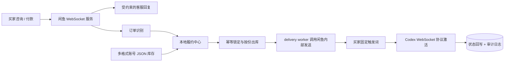

<div align="center">

# 🧾 Xianyu Codex Commerce Suite

**闲鱼消息、订单与本地库存履约的一体化系统**

把咨询、付款识别、库存出库、自动发货、买家确认与激活审计串成可回放的履约链路。

最后更新：2026-08-19。

[](https://react.dev/)
[](https://www.typescriptlang.org/)
[](https://fastapi.tiangolo.com/)
[](https://www.docker.com/)
[](https://www.sqlite.org/)

[部署教程](docs/DEPLOYMENT_GUIDE.md) · [核心能力](#-核心能力) · [业务架构](#️-业务架构) · [快速开始](#-快速开始) · [履约流程](#-履约流程) · [安全说明](#-安全说明)

</div>

---

## 📖 项目简介

**Xianyu Codex Commerce Suite** 面向闲鱼虚拟商品履约场景，将闲鱼自动回复、订单处理和本地库存中心整合在同一个仓库中。

项目沉淀自真实订单流程：当实时注册无法稳定支撑订单峰值时，主链路改为“CPA JSON 批量导入 + 本地库存状态机 + 闲鱼自动发货”，并通过幂等 Key、审计日志和买家触发词降低重复出库、重复发货和错误激活风险。

> 💡 一句话概括：**前台负责接单和沟通，履约中心负责库存、状态与审计。**

## 更新记录

- 2026-06-26：已经结束的 Codex 邀请重置活动，也记念我当时在闲鱼完成的 300 多单重置。
- 2026-08-03：新出邀请好友送额度活动。与上一轮可以使用 Codex CLI 激活不同，本轮必须通过 ChatGPT 桌面端中的 Codex 发起会话，因此重新设计了桌面激活链路。
- 2026-08-04：最近进货侧以及openai风控提升，频繁掉凭证。但仍不影响反代链路，只是无法登录desktop，对于提供账号密码的凭证支持重拉Oauth刷新凭证。
- 2026-08-05：在闲鱼卖了 50 多单。高峰期出现发货延迟、桌面激活串行等问题，因此增加持久化发货队列、多实例激活和批量凭证更新。给闲鱼这群人售后太消耗精力，遂开源。
- 2026-08-14：在好心群友的技术支持下新增了协议激活方式——不再唤起桌面端发消息，而是装包成 WebSocket 帧直接走 Codex 协议发送激活，大大提升并发、减少占用；原有 CLI 与桌面端模式保留，后台可选择三种激活提供方。新方式为实验性功能，暂未经过真实账号测试。
- 2026-08-16：通过真实账号测试并修整 WebSocket 激活链路，现已确认真实可用并设为默认激活模式；保留全部可编辑配置，部署后填写可用代理即可激活。
- 2026-08-19：扩展履约中心库存工具，兼容 CPA、Sub2API 与 Cockpit Tools 等账号 JSON，并增加按选中库存批量导出、格式转换和安全删除。

## ✨ 核心能力

- 💬 **闲鱼账号与消息接入** —— 支持在线聊天、咨询分类、商品和订单管理。
- 🤖 **约束式客服回复** —— 使用场景化提示词，限制无关回答、议价承诺和库存幻觉。
- 📦 **自动出库** —— 付款后按真实订单份数从本地库存中心锁定合格账号。
- 🧾 **多格式库存工具** —— 自动识别 CPA、Sub2API、Cockpit Tools 与 `auth.json`，并支持选中库存批量转换导出和安全删除。
- 🔄 **库存状态机** —— 管理未出库、已出库、待激活、已激活与激活失败状态。
- ✅ **买家确认触发** —— 完整触发词回传后执行后续激活和状态回写。
- 🛡️ **幂等与审计** —— 防止重复出库、重复发货和重复激活，并保留操作日志。
- 🚨 **低库存预警** —— 库存低于阈值时在管理端提示。
- 📬 **持久化发货队列** —— 付款事件快速入队，由 delivery worker 负责库存分配和闲鱼内部发送。
- 🔌 **WebSocket 协议激活** —— 默认通过 Codex 两阶段 WebSocket 会话完成激活，减少桌面窗口占用。
- 🖥️ **多模式回退** —— 保留 ChatGPT/Codex 桌面实例与 Codex CLI，便于兼容不同运行环境。
- 🔁 **OAuth 批量刷新** —— 批量任务持久化，支持取消未执行项和重试失败项。

## 🏗️ 业务架构



### 系统分工

| 子系统 | 职责 |
| --- | --- |
| `xianyu-auto-reply` | 闲鱼账号、聊天、商品、订单、卡券和自动发货 |
| `fulfillment-center` | 多格式库存导入导出、库存筛选、持久化队列、三种激活模式、OAuth 批处理与审计 |
| [`codex-oauth-auto-register`](https://github.com/ZorIgn/codex-oauth-auto-register) | 配套账号导入/注册、OAuth 验证、接码轮询与 CPA 导出 |

## 🛠️ 技术栈

| 领域 | 选型 |
| --- | --- |
| 管理端 | React 18、TypeScript、Vite 5、Zustand、Framer Motion、Recharts |
| 履约 API | Python 3.11+、FastAPI、Pydantic、HTTPX |
| 数据与状态 | SQLite、本地审计日志、幂等 Key |
| 基础设施 | Docker Compose、MySQL、Redis |
| 自动化 | Windows Batch、PowerShell、Codex WebSocket、ChatGPT 桌面端与 Codex CLI |

## 🚀 快速开始

> **第一次部署请先阅读：[完整中文部署教程](docs/DEPLOYMENT_GUIDE.md)**

### 环境要求

- Windows 10 / 11
- Python 3.11+
- Node.js 18+
- Docker Desktop
- Git
- WebSocket 激活所需的可用代理；ChatGPT 桌面端与 Codex CLI 为可选回退

### 1. 获取项目

```bat
git clone https://github.com/ZorIgn/xianyu-codex-commerce-suite.git
cd xianyu-codex-commerce-suite
```

### 2. 启动

```bat
start-all.bat
```

脚本会检查本机环境，在仓库目录中准备 Python 虚拟环境、前端依赖、Playwright Chromium 和运行缓存，并启动 Docker Desktop、MySQL、Redis 与应用服务。已经安装且健康的依赖和服务会被复用。

### 3. 配置

首次运行会根据各服务的 `.env.example` 创建本地 `.env`。在管理页面使用前，需要确认：

- `services\xianyu-auto-reply\websocket\.env` 中已填写 `FULFILLMENT_CENTER_ITEM_IDS`，或明确启用 `FULFILLMENT_CENTER_ALL_ITEMS=true`。
- `services\fulfillment-center\.env` 中的 `ACTIVATION_PROVIDER=ws`，并将 `WS_PROXY_URL` 改为本机实际可用的代理地址。

真实凭据、库存文件和本地 `.env` 不应提交到 Git。

| 服务 | 地址 |
| --- | --- |
| 闲鱼管理后台 | <http://127.0.0.1:9000> |
| 本地库存中心 | <http://127.0.0.1:8765> |
| Backend Web | <http://127.0.0.1:8089> |
| WebSocket | <http://127.0.0.1:8090> |
| Scheduler | <http://127.0.0.1:8091> |

## 🔄 履约流程

1. 在管理后台绑定闲鱼账号，并保持 WebSocket 服务在线。
2. 开启自动确认发货与自动发货。
3. 将目标商品唯一绑定到用于履约的卡券。
4. 在库存中心导入 CPA、Sub2API、Cockpit Tools 或 `auth.json` 账号数据。
5. 买家付款后，闲鱼 websocket 调用 `/webhooks/xianyu/order-paid` 快速入队，delivery worker 再按订单份数原子分配库存。
6. delivery worker 调用闲鱼内部发送接口；成功回写 `account_sent`，失败或等待重试回写 `send_pending`。
7. 订单详情同步发现数量增加时调用 `/delivery/jobs/{order_id}/reconcile`，即使订单已经 `shipped` 也继续补齐；买家完整回复约定触发词后，履约中心执行激活并回写状态。

### 库存筛选

库存中心会筛选基础合格账号：

- 未失效
- token 未 revoked
- 重置次数未超限
- 未被其他订单锁定

### 关键接口

| 方法 | 路径 | 用途 |
| --- | --- | --- |
| `POST` | `/webhooks/xianyu/order-paid` | 付款事件进入持久化发货队列；需携带 `order_id`、`item_id`、`buyer_id`、真实 `chat_id`、`account_id`、`quantity` |
| `POST` | `/delivery/jobs/{order_id}/reconcile` | 订单数量变大后的库存补齐，允许订单已 `shipped` |
| `POST` | `/webhooks/xianyu/message` | 接收买家确认消息并触发流程 |
| `POST` | `/fulfillments/{order_id}/activate` | 管理端手动补救激活 |
| `POST` | `/fulfillments/ship` | 管理端人工兼容入口，不是闲鱼付款主链路 |

## 📂 项目结构

```text
xianyu-codex-commerce-suite/
├── start-all.bat             Windows 一键启动
├── stop-all.bat              停止应用服务
├── stop-infra.bat            停止 Docker 基础设施
├── scripts/                  PowerShell 启停实现
└── services/
    ├── xianyu-auto-reply/
    │   ├── frontend/         React 管理端
    │   ├── backend-web/      管理后台 API
    │   ├── websocket/        闲鱼 IM、订单与发货主服务
    │   ├── scheduler/        定时任务
    │   ├── common/           公共模型、数据库与工具
    │   └── docker-compose*.yml
    └── fulfillment-center/
        ├── app/              库存、履约、OAuth 与激活提供方
        └── tests/            履约中心测试
```

## 🔌 激活模式

- `ws`：默认模式。使用 Codex WebSocket 两阶段预热/turn 会话，不拉起桌面窗口。
- `desktop`：使用绑定的 ChatGPT/Codex 桌面实例，作为可视化兼容模式。
- `cli`：使用 Codex CLI，保留给需要命令行激活的环境。

模型、代理、客户端版本、originator、重连次数和超时时间均可在库存中心的“绑定与模板”中修改。

## 🛑 停止服务

```bat
stop-all.bat
stop-infra.bat
```

`stop-all.bat` 停止应用服务并保留 MySQL、Redis；`stop-infra.bat` 用于停止基础设施。

## 🛡️ 安全说明

本仓库默认不应提交：

- `.env`、API Key、Cookie、Token
- 数据库、库存文件和账号 JSON
- 日志、虚拟环境和运行缓存
- Docker、Node 和 Python 构建产物

公开运行时还应配置访问控制、敏感字段保护、速率限制和审计日志保留周期。本项目包含第三方开源项目的集成与二次开发，使用和分发前请逐项确认上游许可证与目标平台服务条款。

## 🙏 项目来源

- 闲鱼系统基于 [`zhinianboke/xianyu-auto-reply`](https://github.com/zhinianboke/xianyu-auto-reply) 整理改造。
- 本地库存履约中心为本仓库新增服务。
- 账号供给侧工具见 [`ZorIgn/codex-oauth-auto-register`](https://github.com/ZorIgn/codex-oauth-auto-register)。

## ⚠️ 免责声明

本项目用于学习、研究和本地自动化流程复盘。请遵守闲鱼、Codex 及相关第三方服务的条款和当地法律法规，不要用于虚假交易、垃圾消息、滥用账号或未经授权的访问。
